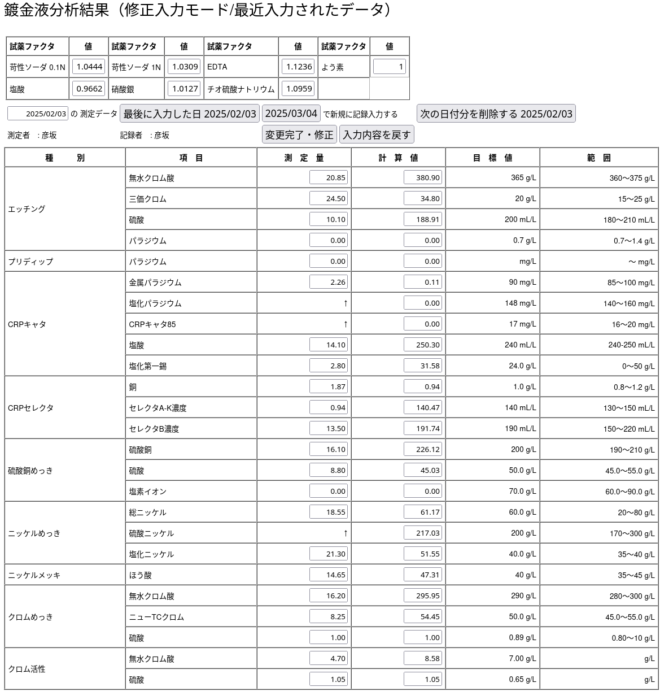

# soldata
* めっき液管理（サンプル）
* 古くはAccess2000　で書かれていたものを node 0.10で置き換えた。
* プラスチックめっき液管理の特殊仕様
* 今回 v22.13.1 用に改めた。

# 必要なもの
* PostgreSQL サーバ（または Podman/Docker で自動起動可能）
* node v22.13.1 が動くデスクトップ環境
* スクリーンショット


## データベースセットアップ（Podman使用）

### 前提条件
* Podman がインストールされていること
* PostgreSQL クライアント（psql）がインストールされていること

### クイックスタート

#### 1. データベースの起動と初期化
```bash
# データベースコンテナを起動
make db-start

# スキーマとシードデータを投入
make db-init
```

または一度にすべて実行：
```bash
# データベースを完全に再作成（起動→スキーマ適用→シード投入）
make db-recreate-clean
```

#### 2. アプリケーションの起動
```bash
npm install
npm start
```

#### 3. データベースの停止
```bash
# コンテナを停止
make db-stop

# コンテナとボリュームを削除して完全クリーンアップ
make db-stop-clean
```

### Makefile コマンド一覧

| コマンド | 説明 |
|---------|------|
| `make db-start` | PostgreSQL コンテナを起動（自動で readiness チェック） |
| `make db-stop` | PostgreSQL コンテナを停止・削除 |
| `make db-stop-clean` | PostgreSQL コンテナとボリュームを削除 |
| `make db-schema` | データベーススキーマを適用 |
| `make db-seed` | シードデータを投入（スキーマ適用済みが必要） |
| `make db-init` | データベースを初期化（スキーマ適用→シード投入） |
| `make db-status` | コンテナの状態を確認 |
| `make db-recreate` | DB を再作成（停止→起動→初期化） |
| `make db-recreate-clean` | DB を完全に再作成（ボリューム削除含む） |

### 環境変数でのカスタマイズ

データベース設定は環境変数で変更可能：

```bash
# カスタムポートでデータベースを起動
POSTGRES_PORT=5433 make db-start

# カスタムデータベース名とユーザー
POSTGRES_DB=mydb POSTGRES_USER=myuser POSTGRES_PASSWORD=mypass make db-start
```

利用可能な環境変数：
- `POSTGRES_CONTAINER_NAME`: コンテナ名（デフォルト: postgres）
- `POSTGRES_PASSWORD`: パスワード（デフォルト: postgres）
- `POSTGRES_DB`: データベース名（デフォルト: soldata）
- `POSTGRES_USER`: ユーザー名（デフォルト: postgres）
- `POSTGRES_PORT`: ホストポート（デフォルト: 5432）

### スクリプトの直接使用

Makefile を使わず、スクリプトを直接使うことも可能：

```bash
# コンテナ起動
bash scripts/pgsql_podman.sh start

# PostgreSQL の準備完了を待つ
bash scripts/wait-for-postgres.sh

# スキーマ適用
bash scripts/apply-schema.sh

# シード投入
bash db/seed/seed.sh

# コンテナ停止
bash scripts/pgsql_podman.sh stop

# ヘルプ表示
bash scripts/pgsql_podman.sh --help
bash scripts/wait-for-postgres.sh --help
```

## GitHub Actions での自動テスト

このリポジトリには GitHub Actions ワークフローが含まれており、以下を自動実行します：

1. Podman と PostgreSQL クライアントのインストール
2. PostgreSQL コンテナの起動と readiness チェック
3. データベーススキーマとシードデータの投入
4. データ検証
5. （オプション）アプリケーションテストの実行

### ワークフローの実行

- `feature/podman-postgres-demo` ブランチへの push 時
- `main` ブランチへの PR 時
- 手動実行（workflow_dispatch）

### 注意事項

#### GitHub Actions 公開ランナーでの制限事項
- GitHub が提供する公開ランナーでは Podman のサポートが限定的な場合があります
- Ubuntu latest ランナーでは Podman は利用可能ですが、バージョンや機能に制約があることがあります
- より安定した環境が必要な場合は、セルフホストランナーの使用を推奨します

#### セルフホストランナーの推奨
本格的な CI/CD パイプラインでは、以下の理由でセルフホストランナーの使用を推奨：
- Podman のバージョン管理が可能
- キャッシュやボリュームの永続化が可能
- ネットワーク設定の柔軟性
- パフォーマンスの向上

## 従来の方法（手動セットアップ）

Podman を使わず、従来通り手動で PostgreSQL をセットアップする場合：

1. PostgreSQL サーバーをインストール・起動
2. `db/pgsql/mkdb` スクリプトでデータベースとユーザーを作成
3. スキーマファイルを適用
4. `db/seed/seed.sh` でシードデータを投入

## トラブルシューティング

### コンテナが起動しない
```bash
# ログを確認
podman logs postgres

# 既存のコンテナを削除して再試行
make db-stop-clean
make db-start
```

### ポートが既に使用されている
```bash
# 別のポートを使用
POSTGRES_PORT=5433 make db-start
```

### シードが失敗する
```bash
# データベースの準備ができているか確認
make db-status
bash scripts/wait-for-postgres.sh

# 完全にリセット
make db-recreate-clean
```

## macOS (Sequoia / Apple Silicon) でのセットアップ

このリポジトリをクローンしてすぐに起動できるよう、macOS 向けの補助スクリプトを `scripts/macos_podman_setup.sh` として用意しています。

前提:
- Homebrew がインストールされていること

簡単な使い方:

```bash
# 実行権限を付与
chmod +x scripts/macos_podman_setup.sh

# スクリプトを実行（podman のインストール、machine 初期化、Postgres コンテナ起動、スキーマ/シード適用を試行します）
./scripts/macos_podman_setup.sh
```

スクリプトの挙動:
- `brew` が無ければ中断します（Homebrew を手動で導入してください）。
- `podman` が無ければ `brew install podman` を試みます。
- `podman machine` を初期化・起動し、Postgres コンテナ（名前: `soldata-postgres`）を起動します。
- `scripts/apply-schema.sh` が実行可能であれば自動実行します（存在しない場合は手動適用を案内します）。
- `db/seed/seed.sh` が実行可能であれば自動でシードを投入します。

接続情報（デフォルト）:
- host: localhost
- port: 5432
- user: postgres
- db: soldata
- password: postgres

トラブルシューティング:
- `podman machine start` が失敗する場合は、`podman machine list` と `podman machine inspect` の出力を確認してください。
- コンテナログの確認: `podman logs soldata-postgres`
- psql で手動接続確認: `psql -h localhost -p 5432 -U postgres -d soldata`

備考:
- Sequoia（macOS 14）や Apple Silicon 環境では、Lima を通した VM の初期化やリソース設定が必要になる場合があります。スクリプトは一般的な初期化を試みますが、環境依存の調整が必要な場合は手動で `podman machine` の設定を行ってください。
